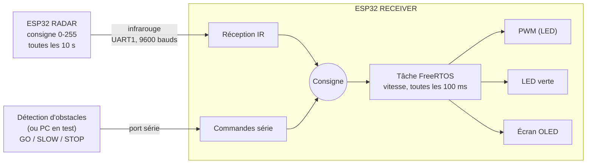

# IRDA_FOR_BELOOP

Firmware C++ pour ESP32 qui transmet une consigne de vitesse par liaison infrarouge et la fait appliquer progressivement par une capsule, avec affichage OLED et commandes d'arrêt et de ralentissement. Réalisé en bureau d'études UrbanLoop, en 3e année à TÉLÉCOM Nancy.

<!-- À COMPLÉTER : photo du montage (deux ESP32, module IR, écran OLED) ou courte vidéo, ex. docs/montage.jpg -->

## Contexte

Bureau d'études de 3e année (novembre 2024 à février 2025), en équipe de 4. Le sujet : une preuve de concept pour le déplacement autonome des mini-capsules d'essai du circuit UrbanLoop de Brabois, avec deux fonctions :

1. **détecter un obstacle** sur la trajectoire de la capsule, à partir des capteurs d'un plateau technique ;
2. **piloter la capsule** : appliquer la consigne de vitesse envoyée par l'infrastructure, puis ralentir ou s'arrêter selon le résultat de la détection.

Ce dépôt couvre la fonction de pilotage. Dans le banc de test du sujet, la consigne de vitesse est émise par l'infrastructure (le « radar ») et reçue par la capsule via une liaison infrarouge IrDA. Les deux côtés sont simulés par deux ESP32. La commande de vitesse, destinée à un banc moteur sous forme analogique (0 à 5 V), est visualisée par l'intensité d'une LED.

**Mon rôle** : le développement des deux ESP32 et de la communication entre eux.

## Fonctionnement

Le même code produit deux firmwares, choisis à la compilation :

- **`RADAR`** (émetteur, côté voie) : envoie une consigne de vitesse (0 à 255) par infrarouge toutes les 10 secondes. Pour les essais, la valeur est tirée au hasard.
- **`RECEIVER`** (récepteur, côté capsule) : reçoit la consigne, fait évoluer la vitesse de la capsule vers cette consigne et affiche l'état sur l'écran OLED.

Côté récepteur :

- **Réception infrarouge** : la liaison passe par l'UART1 de l'ESP32 (9600 bauds). Seuls les nouveaux messages sont pris en compte.
- **Commandes série** : `GO` (reprendre la dernière consigne reçue), `SLOW` (ralentir à 64/255) et `STOP` (consigne à 0). Dans l'architecture du sujet, elles viennent de l'unité de calcul qui détecte les obstacles ; ici elles arrivent sur le port série de l'ESP32 (115200 bauds), par exemple depuis un PC.
- **Accélération et décélération progressives** : une tâche FreeRTOS recalcule la vitesse toutes les 100 ms. Le pas dépend de l'écart à la consigne (pas plus grand quand l'écart est grand), et la décélération est 1,3 fois plus forte sur `STOP`.
- **Sorties** : vitesse reproduite en PWM (sur une LED dans ce montage), LED verte allumée tant que la vitesse n'a pas atteint la consigne, écran OLED avec vitesse actuelle / consigne, dernière commande et tension équivalente (0 à 5 V).
- **Accès concurrents** : un mutex protège l'écran OLED, un sémaphore encadre la mise à jour de la consigne entre la réception infrarouge et le port série.



## Matériel

| Élément | Branchement |
|---|---|
| Carte | ESP32 DevKit (`esp32dev`) |
| Liaison infrarouge | UART1 : TX sur GPIO 32, RX sur GPIO 35 |
| Écran OLED SSD1306 (I2C, adresse `0x3C`) | SDA sur GPIO 5, SCL sur GPIO 4 |
| Sortie vitesse (PWM) | GPIO 33 |
| LED verte (vitesse en cours de changement) | GPIO 25 |

## Stack

- C++ (framework Arduino pour ESP32), driver UART de l'ESP-IDF
- FreeRTOS : tâche, mutex, sémaphore binaire
- PlatformIO
- Bibliothèque ThingPulse pour l'écran SSD1306

## Compiler et flasher

Prérequis : [PlatformIO](https://platformio.org/) (extension VS Code ou CLI).

Le rôle se choisit dans `IRDA/platformio.ini`, en gardant une seule des deux lignes actives :

```ini
build_flags =
;    -D RADAR
    -D RECEIVER
```

Puis :

```bash
cd IRDA
pio run -t upload       # compiler et flasher
pio device monitor      # moniteur série (115200 bauds), pour envoyer GO / SLOW / STOP
```

## Structure

```
IRDA/
├── platformio.ini   configuration de la carte et choix RADAR / RECEIVER
└── src/
    ├── main.cpp     logique émetteur et récepteur, tâche FreeRTOS de vitesse
    ├── Irda.cpp/.h  liaison infrarouge sur l'UART1
    └── oled.cpp/.h  affichage sur l'écran SSD1306
```

## Auteur

[Matthias Germain](https://github.com/MatthiasGermain)
